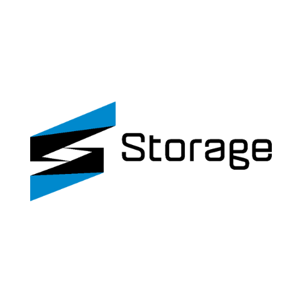

[](https://sstorage.vn)

# Ước Lượng Cấu Hình Server Cho 100 Player

Dựa trên kinh nghiệm thực tế và tài liệu từ **diễn đàn Xibo**, có thể tham khảo:

## Tài Nguyên & Khuyến Nghị

| **Tài nguyên** | **Mức khuyến nghị cho 100 player** |
|--------------|----------------------------------|
| **CPU** | 4 - 8 vCPU (Intel Xeon hoặc AMD EPYC) |
| **RAM** | 16 - 32GB |
| **Băng thông** | 50 - 200 Mbps (tùy nội dung) |
| **Storage** | SSD NVMe, tối thiểu 500GB (nếu nhiều video thì >=1TB) |

## Giải Thích

- **CPU**: Xibo CMS chủ yếu dùng PHP/MySQL, nếu có nhiều request từ player thì cần CPU mạnh để xử lý.
- **RAM**: Nếu nhiều player tải dữ liệu cùng lúc, cần RAM đủ để MySQL và PHP-FPM hoạt động tốt.
- **Băng thông**: Nếu mỗi player tải **100MB nội dung/ngày**, thì tổng băng thông là **10GB/ngày (~120KB/s trung bình)**.  
  Nhưng nếu phát video Full HD liên tục, băng thông có thể tăng rất cao.
- **Storage**: Nếu lưu video, nên dùng **SSD** để tăng tốc độ đọc dữ liệu.


## Điều kiện tiên quyết

Các container Docker phát triển không tự động xây dựng các tệp nhà cung cấp cho PHP hoặc JS, điều này được giao cho trách nhiệm của nhà phát triển. Do đó, bạn sẽ cần các công cụ sau:

 - Git
 - [Composer](http://getcomposer.org)
 - NodeJS version 12
 - npm
 - Docker


## Clone the repository

Tạo một thư mục trong không gian làm việc phát triển của bạn và sao chép kho lưu trữ. Nếu bạn có ý định thực hiện thay đổi và gửi
yêu cầu kéo, vui lòng Fork chúng tôi trước và tạo một nhánh mới.

```shell
git clone https://github.com/tlamabc/sstorage-digital-Signage
```

Tạo folder cho database
```shell
mkdir /db_signage/
```

## Install dependencies
Đi đến folder của source

```sh
cd ./sstorage-digital-Signage
```
Chúng tôi khuyên bạn nên cài đặt các phụ thuộc thông qua Docker để đảm bảo các phụ thuộc nhất quán trên
các máy phát triển khác nhau.

### PHP dependencies

```shell
docker run --interactive --tty --volume $PWD:/app --volume ~/.composer:/tmp composer install
```


Lệnh này cũng gắn thư mục `/tmp` của Composer vào thư mục gốc của bạn để bạn có thể tận dụng
bộ nhớ đệm của Composer.

### Website dependencies (webpack)


chạy bằng Docker container:

```shell
docker run -it --volume $PWD:/app --volume ~/.npm:/root/.npm -w /app node:22 sh -c "npm install webpack -g; npm install; npm run build;"
```

### Mapped Volumes

Phiên bản phát triển của Xibo mong đợi cơ sở mã được ánh xạ vào container sao cho các thay đổi trên máy chủ
được phản ánh trong container.

Tuy nhiên, bản thân container tạo ra một số tệp, chẳng hạn như bộ đệm twig và tải lên thư viện. Những vị trí này sẽ cần
được tạo và container được cấp quyền truy cập vào chúng.

Cách dễ nhất để thực hiện việc này là tạo các thư mục `cache` và `library` và `chmod 777` chúng. Rõ ràng là điều này không
phù hợp cho sản xuất, nhưng bạn không nên sử dụng các tệp này cho sản xuất (chúng tôi có các container cho mục đích đó).


### OpenOOH specification
Xibo có thể trình bày các phân loại địa điểm OpenOOH trong biểu mẫu chỉnh sửa hiển thị. Để chức năng này hoạt động trong
phát triển, cần
[tải xuống tệp mới nhất](https://raw.githubusercontent.com/openooh/venue-taxonomy/main/specification.json) và
đặt tệp đó vào đây: `openooh/specification.json`

Các thùng chứa sản xuất/CI thêm tệp này trong quá trình xây dựng để tệp đó đã có sẵn trong
image Docker.


## Bring up the Containers

Sử dụng Docker Compose để đưa các container chạy lên.
```sh
docker-compose up --build -d
```


## Login
Sau khi các container xuất hiện, bạn sẽ có thể đăng nhập bằng account:
U: `admin`
P: `password`


## Swagger API Docs
Để tạo tệp `swagger.json`, với các container dev đang chạy:
```shell
docker-compose exec web sh -c "cd /var/www/cms; vendor/bin/swagger lib -o web/swagger.json"
```


## =======================================================================================================================================================


# Hướng dẫn Migration nếu lỗi cms.settings!!!!

## 1. Truy cập vào container web


```bash
docker exec -it <ID container web> bash
```

Vào folder của web
```
cd /var/www/cms
```

Chạy lệnh này để migrate
```
php vendor/bin/phinx migrate -c /var/www/cms/phinx.php

```
## =======================================================================================================================================================

## Nếu vấn để liên quan đến database, Lâm DevOps of ICSP có thể support qua zalo: 0359001647. Thanks

# =======================================================================================================================================================

## Licence

[]()

Copyright (C) 2006-2024 Xibo Signage Ltd and Contributors.

Xibo is free software: you can redistribute it and/or modify it under the terms of the GNU Affero General Public
License as published by the Free Software Foundation, either version 3 of the License, or any later version.

Xibo is distributed in the hope that it will be useful, but WITHOUT ANY WARRANTY; without even the implied warranty
of MERCHANTABILITY or FITNESS FOR A PARTICULAR PURPOSE.  See the GNU Affero General Public License for more details.

You should have received a copy of the GNU Affero General Public License along with Xibo. 
If not, see <http://www.gnu.org/licenses/>.


# Installation

We recommend installing an official release via Docker. Instructions for doing so can be found in our 
[documentation](https://xibosignage.com/docs/setup/cms-installation-guides).

